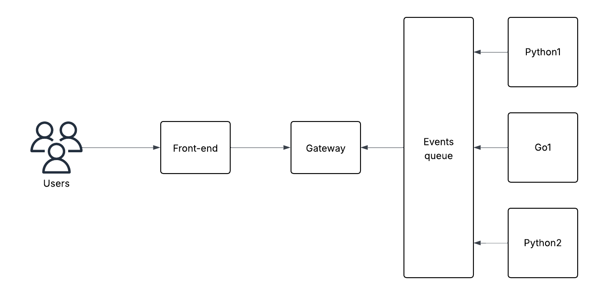
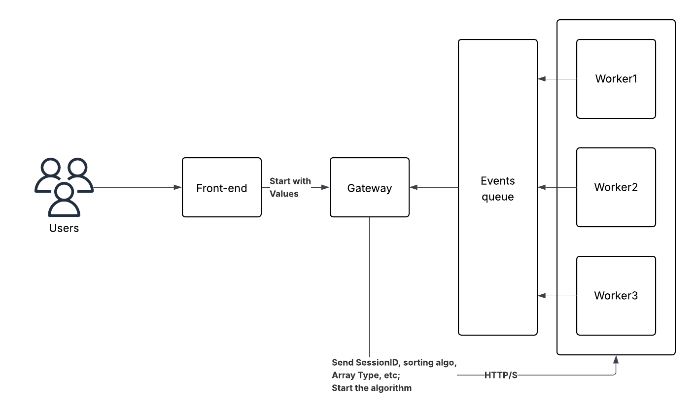

# DS-Algorithm Visualization

### Rough Diagram:

After some careful thinking about triggering workers I have came up with more refined solution.

### Upcoming tasks
- Gateway coding in GOLNAG.
- Security implementations in Gateway to allow user to run only 3 different work in one time. (Rate limiting)
- If new worker nodes are added I need a way to add them in the worker group and use some sort of weighted sticky session. (Need to research about this).

### Front-end
- ReactJS very basics.

### Gateway service (GoLang)
- Consumes events from the Redis Streams.
- Play, Pause, Resume and Stop functionality for front-end.

### Redis Streams (Holds all the events)
- Holds all the events.

### Data Structure and Algorithm services
- Python and Go services which puts the events in the Redis streams.

